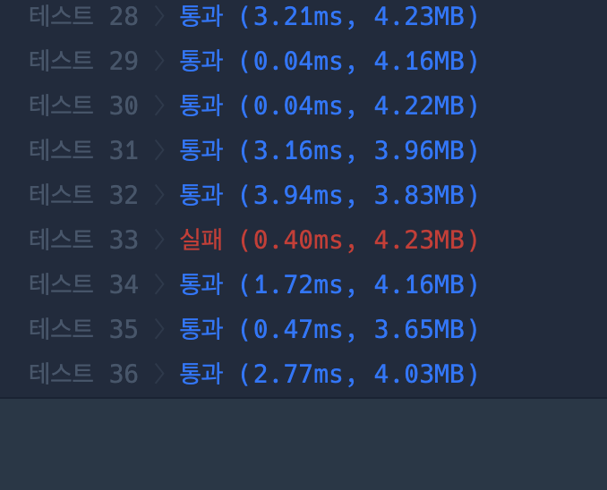

```c++
#include <string>
#include <vector>
#include <bits/stdc++.h>

using namespace std;
const int MAX = 2e9;
vector<int> solution(int m, int n, int startX, int startY, vector<vector<int>> balls) {
    vector<int> answer;
    
    for(int i = 0; i < balls.size(); i++){
        int x = balls[i][0];
        int y = balls[i][1];
        
        // x,y와 startX startY의 차이
        int diffX = x > startX ? x - startX : startX - x;
        int diffY = y > startY ? y - startY : startY - y;
        
        cout<<diffX<<" "<<diffY<<endl;
        
        // x,y와 startX startY의 합
        int sumX = x + startX < m ? x + startX : 2*m - x - startX;
        int sumY = y + startY < n ? y + startY : 2*n - y - startY;
        cout<<sumX<<" "<<sumY<<endl;
        
        int left = sumX * sumX + diffY * diffY;
        int right = sumY * sumY + diffX * diffX;
        // 같은 선상에 있을시에 먼저 부딪히는 경우 제외시키기. 
        
        // 같은 x 선상에 있는 경우
        if(startX == x && startY > y && startY + y < n )right = MAX;
        if(startX == x && startY < y && startY + y > n )right = MAX;
        
        // 같은 y 선상에 있는 경우
        // 이게 예제 2번임
        if(startY == y && startX > x && startX + x < m)left = MAX;
        if(startY == y && startX < x && startX + x > m )left = MAX;
        
        int minDistance = min(left , right);
        cout<<minDistance<<endl;
        answer.push_back(minDistance);        
    }
    
    return answer;
}
```